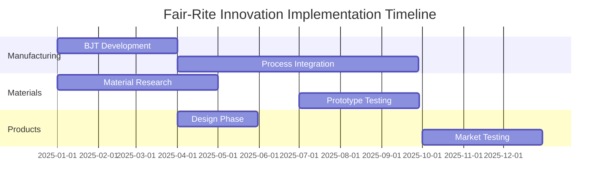
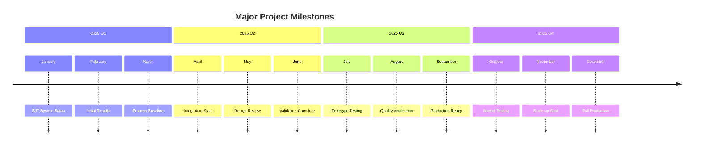
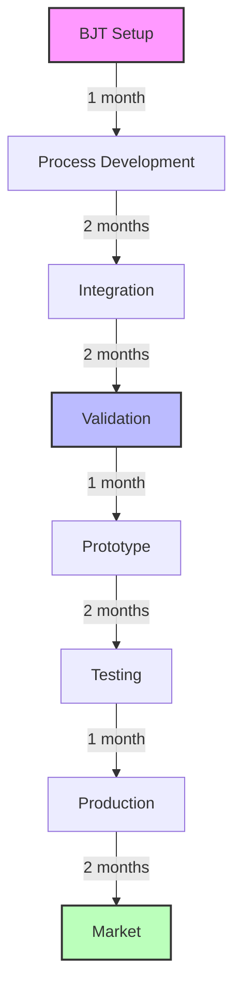
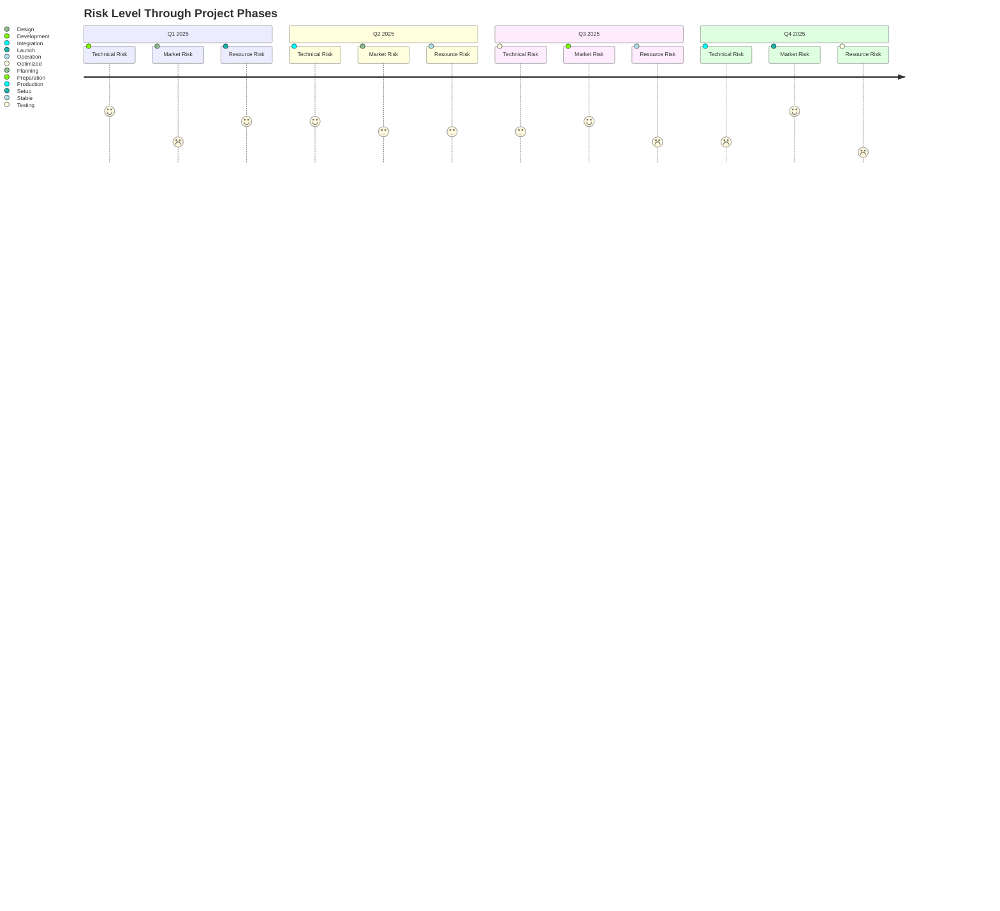

# Implementation Timeline

## Project Timeline Visualization



## Detailed Phase Breakdown

### Phase 1: Foundation (2025-Q1)
```
January 2025
├── BJT System Setup
├── Initial Material Research
└── Team Formation

February 2025
├── Process Parameter Development
├── Material Characterization
└── Preliminary Testing

March 2025
├── BJT Process Optimization
├── Material Property Analysis
└── Initial Results Review
```

### Phase 2: Development (2025-Q2)
```
April 2025
├── Process Integration Start
├── Design Phase Initiation
└── Material Refinement

May 2025
├── Integration Testing
├── Design Optimization
└── Property Validation

June 2025
├── Process Validation
├── Design Finalization
└── Performance Testing
```

### Phase 3: Testing (2025-Q3)
```
July 2025
├── Prototype Testing Start
├── Process Refinement
└── Quality Control Setup

August 2025
├── Extended Testing
├── Process Documentation
└── Performance Validation

September 2025
├── Final Adjustments
├── Documentation
└── Pre-market Preparation
```

### Phase 4: Market (2025-Q4)
```
October 2025
├── Market Testing Start
├── Customer Feedback
└── Process Optimization

November 2025
├── Market Response Analysis
├── Production Scaling
└── Performance Monitoring

December 2025
├── Full Production Planning
├── Market Expansion
└── Year-end Review
```

## Resource Allocation Timeline

### Q1 2025 (January - March)
```
Resource Category | Allocation | Timeline
-----------------|------------|----------
Equipment        | $800K      | Jan-Feb
Personnel        | $300K      | Jan-Mar
Materials        | $200K      | Feb-Mar
Training         | $100K      | Mar
```

### Q2 2025 (April - June)
```
Resource Category | Allocation | Timeline
-----------------|------------|----------
Process Dev      | $500K      | Apr-May
Testing          | $300K      | May-Jun
Integration      | $400K      | Jun
Documentation    | $100K      | Jun
```

### Q3 2025 (July - September)
```
Resource Category | Allocation | Timeline
-----------------|------------|----------
Testing          | $400K      | Jul-Aug
Validation       | $300K      | Aug-Sep
Quality Control  | $200K      | Sep
Documentation    | $100K      | Sep
```

### Q4 2025 (October - December)
```
Resource Category | Allocation | Timeline
-----------------|------------|----------
Market Testing   | $500K      | Oct-Nov
Production Prep  | $400K      | Nov-Dec
Documentation    | $200K      | Dec
Review & Planning| $100K      | Dec
```

## Key Milestones



## Critical Path Analysis



## Risk Timeline

