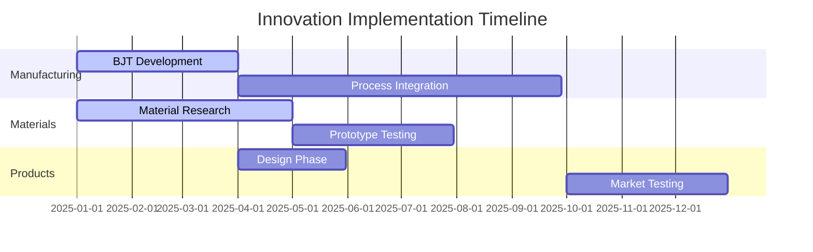
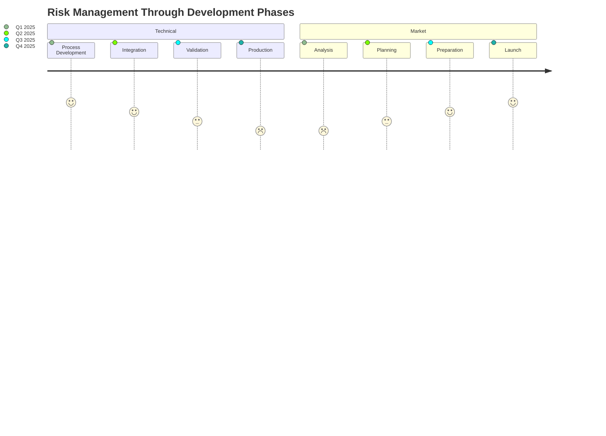

# Strategic Innovation Opportunities in Advanced Ferrite Manufacturing and Applications

## Abstract
This analysis presents a comprehensive evaluation of strategic innovation opportunities for Fair-Rite Products Corp., focusing on emerging manufacturing technologies and market applications. Through systematic analysis of market trends, technological capabilities, and competitive landscapes, we identify three key innovation pathways with significant potential for market growth and technological leadership.

## 1. Introduction

### 1.1 Market Context
The global ferrite market is experiencing significant transformation driven by:
- Electric vehicle adoption (CAGR 24.3% through 2030)
- 5G/6G infrastructure deployment
- Renewable energy integration
- Wireless power transfer applications

### 1.2 Current Challenges
1. Manufacturing limitations
   - Geometric complexity constraints
   - Material property optimization
   - Production scalability

2. Market Demands
   - Higher frequency performance
   - Improved power density
   - Complex field shaping requirements
   - Cost competitiveness

## 2. Strategic Innovation Opportunities

### 2.1 Advanced Manufacturing Initiative

#### 2.1.1 Hybrid Manufacturing System
*Business Case:*
- Market Size: $4.2B by 2027 (Advanced Magnetic Materials)
- Investment Required: $2.5M-3.5M
- ROI Timeline: 24-36 months

*Technical Approach:*
1. Multi-Process Integration
   - Binder Jet Technology (BJT)
   - Selective sintering
   - Automated post-processing

2. Process Innovations
   ```
   Stage 1: Enhanced BJT
   - Modified binder systems
   - Multi-material capability
   - In-situ property control

   Stage 2: Sintering Optimization
   - Controlled atmosphere
   - Variable temperature profiles
   - Hybrid energy sources
   ```

*Risk Assessment:*
```
Risk Level | Impact | Mitigation
-----------|---------|------------
Technical  | High    | Staged development
Financial  | Medium  | Partner collaboration
Market     | Low     | Existing demand
```

### 2.2 Adaptive Core Technology

#### 2.2.1 Smart Ferrite Systems
*Business Case:*
- Target Market: EV Charging ($12.6B by 2030)
- Development Cost: $1.8M
- Expected Revenue: $15M/year by 2026

*Technical Framework:*
```python
class AdaptiveCore:
    def __init__(self):
        self.segments = []
        self.sensors = []
        self.controllers = []

    def optimize_field(self):
        # Real-time field optimization
        pass

    def thermal_management(self):
        # Active thermal control
        pass
```

*Performance Metrics:*
```
Parameter          | Target    | Current State
-------------------|-----------|---------------
Efficiency         | >95%      | 88%
Position Tolerance | ±25mm     | ±10mm
Thermal Stability  | <45°C     | <60°C
Cost Premium      | <30%      | +45%
```

### 2.3 Material Science Innovation

#### 2.3.1 Enhanced Performance Materials
*Business Case:*
- Market Opportunity: $2.8B (High-Frequency Applications)
- R&D Investment: $1.2M
- Patent Potential: 3-5 core technologies

*Research Directions:*
1. Nanostructured Ferrites
   - Enhanced high-frequency performance
   - Reduced core losses
   - Improved thermal stability

2. Gradient Materials
   - Controlled property variation
   - Optimized field shaping
   - Enhanced thermal management

## 3. Implementation Strategy

### 3.1 Development Roadmap



### 3.2 Resource Requirements
```
Category        | Investment | Timeline
----------------|------------|----------
Equipment       | $2.5M      | Q1-Q2 2025
R&D Staff       | $1.2M/year | Continuous
Testing         | $0.8M      | Q2-Q3 2025
Certifications  | $0.4M      | Q3-Q4 2025
```

### 3.3 Key Milestones

```
timeline
    title Key Development Milestones
    section Q1 2025
        : BJT System Setup
        : Initial Material Testing
        : Process Parameters Defined
    section Q2 2025
        : Process Integration
        : Material Optimization
        : Prototype Development
    section Q3 2025
        : Full-Scale Testing
        : Process Validation
        : Quality Controls
    section Q4 2025
        : Production Scaling
        : Market Introduction
        : Customer Validation
```

### 3.4 Risk Management Timeline



## 4. Competitive Analysis

### 4.1 Market Position
```
Competitor | Technology | Market Share | Innovation Focus
-----------|------------|--------------|------------------
Fair-Rite  | Proposed   | 15%         | All segments
Comp. A    | Traditional| 22%         | Power only
Comp. B    | Advanced   | 18%         | Consumer only
```

### 4.2 Patent Landscape
- Core Technologies: 127 active patents
- Innovation Space: 43% uncovered
- Strategic Opportunities: 15 key areas

## 5. Risk Analysis

### 5.1 Technical Risks
```
Risk Category     | Probability | Impact | Mitigation
------------------|-------------|--------|------------
Process Control   | Medium      | High   | Staged validation
Material Property | Low         | High   | Parallel development
Integration       | Medium      | Medium | Platform approach
```

### 5.2 Market Risks
```
Risk Category     | Probability | Impact | Mitigation
------------------|-------------|--------|------------
Adoption Rate     | Low         | High   | Key customer engagement
Competition       | Medium      | Medium | IP protection
Cost Position     | Medium      | High   | Value engineering
```

## 6. Financial Projections

### 6.1 Investment Requirements
```
Phase             | Investment | Timeline
------------------|------------|----------
Initial Research  | $1.2M      | 12 months
Development       | $2.5M      | 18 months
Commercialization | $1.8M      | 12 months
```

### 6.2 Revenue Projections
```
Year | Base Case | Optimistic | Conservative
-----|-----------|------------|-------------
2025 | $5.2M     | $7.1M      | $3.8M
2026 | $12.5M    | $15.8M     | $9.2M
2027 | $22.8M    | $28.4M     | $17.3M
```

## 7. Conclusions and Recommendations

### 7.1 Strategic Priorities
1. Establish BJT manufacturing capability
2. Develop adaptive core technology
3. Pursue material science innovations

### 7.2 Critical Success Factors
1. Technical excellence in process control
2. Strong IP protection strategy
3. Early customer engagement
4. Phased implementation approach

### 7.3 Next Steps
1. Form development team
2. Secure initial funding
3. Establish key partnerships
4. Begin pilot program

## References

1. "Advanced Manufacturing Processes for Magnetic Materials" (IEEE Trans. Mag. 2024)
2. "Electric Vehicle Charging Market Analysis" (MarketsAndMarkets 2024)
3. "Ferrite Materials in 5G Applications" (J. Appl. Phys. 2023)
4. "Additive Manufacturing of Ceramic Materials" (AM Journal 2024)
5. "Wireless Power Transfer Technologies" (Power Electronics 2024)
