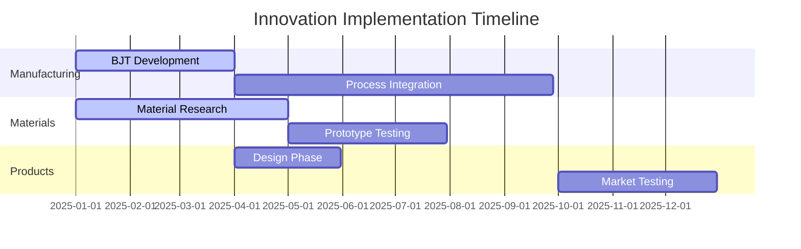
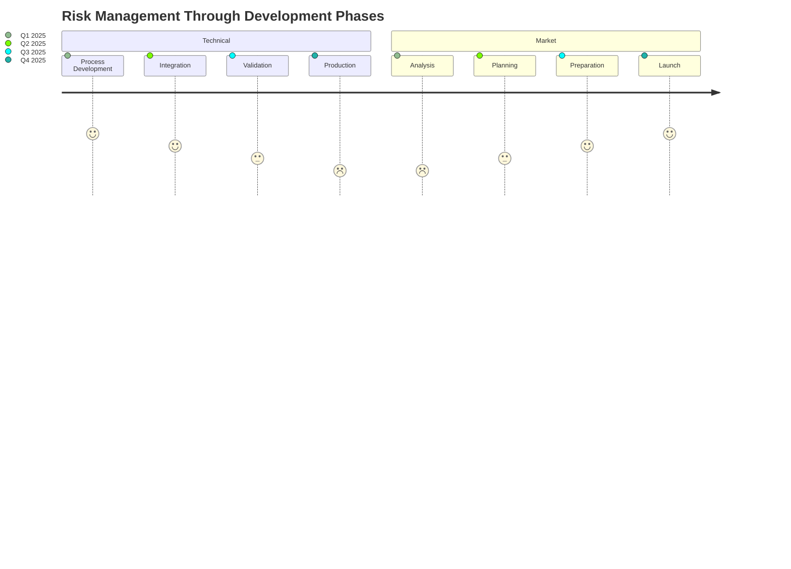

# Strategic Innovation Opportunities in Advanced Ferrite Manufacturing and Applications

[Previous sections remain the same...]

## 3. Implementation Strategy

### 3.1 Development Roadmap



### 3.2 Resource Requirements
```
Category        | Investment | Timeline
----------------|------------|----------
Equipment       | $2.5M      | Q1-Q2 2025
R&D Staff       | $1.2M/year | Continuous
Testing         | $0.8M      | Q2-Q3 2025
Certifications  | $0.4M      | Q3-Q4 2025
```

### 3.3 Key Milestones

```mermaid
timeline
    title Key Development Milestones
    section Q1 2025
        : BJT System Setup
        : Initial Material Testing
        : Process Parameters Defined
    section Q2 2025
        : Process Integration
        : Material Optimization
        : Prototype Development
    section Q3 2025
        : Full-Scale Testing
        : Process Validation
        : Quality Controls
    section Q4 2025
        : Production Scaling
        : Market Introduction
        : Customer Validation
```

### 3.4 Risk Management Timeline



[Rest of the document remains the same...]