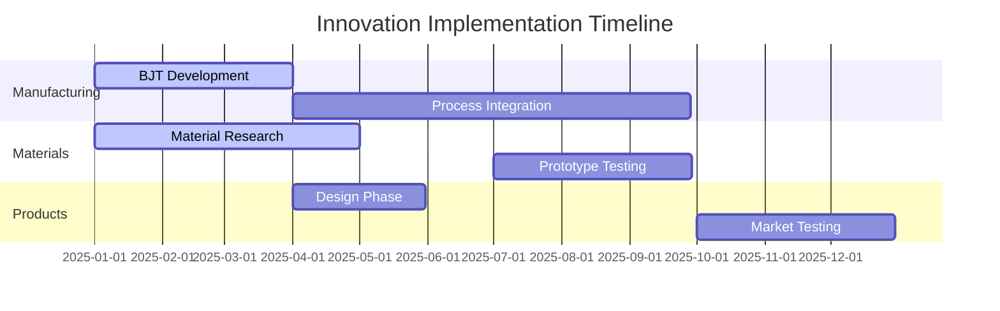
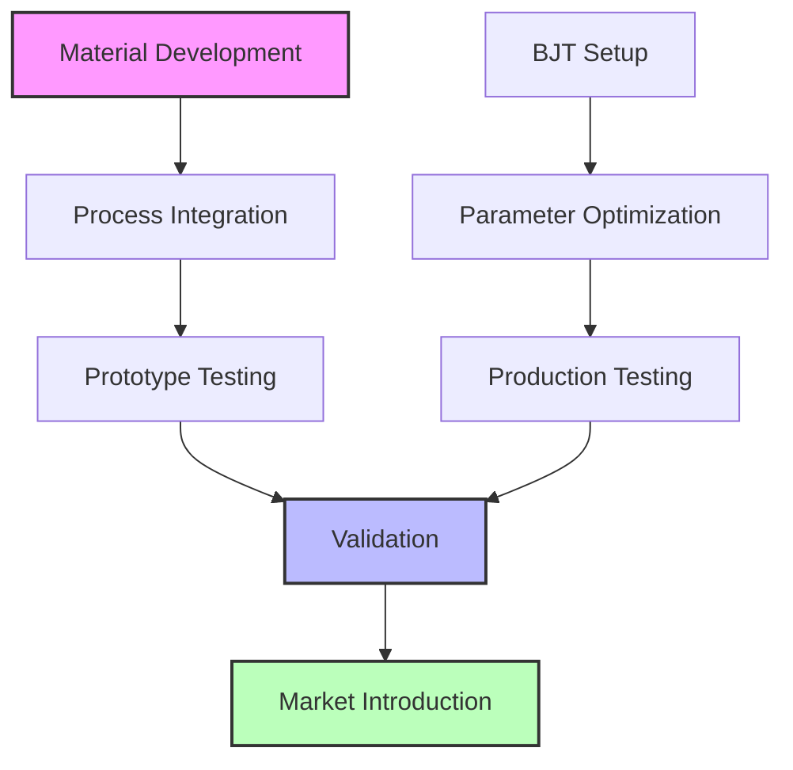
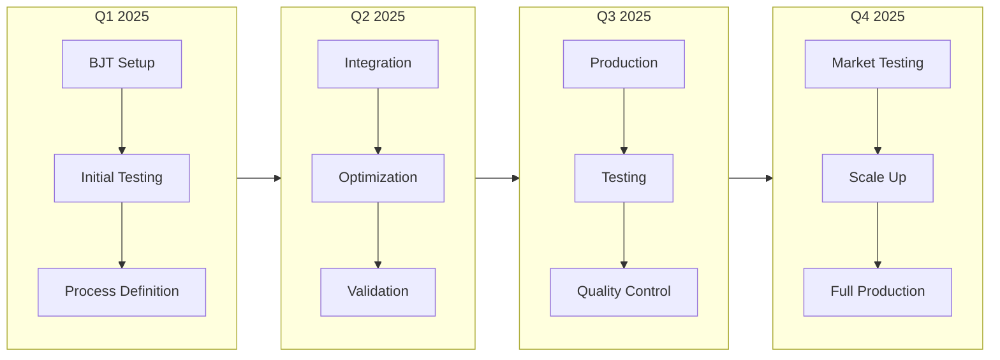
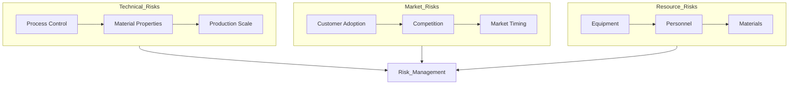

# Strategic Innovation Opportunities in Advanced Ferrite Manufacturing and Applications

## 3. Implementation Strategy

### 3.1 Development Roadmap



### 3.2 Process Flow



### 3.3 Development Phases



### 3.4 Risk Assessment



### 3.5 Resource Requirements

```
Category        | Investment | Timeline
----------------|------------|----------
Equipment       | $2.5M      | Q1-Q2 2025
R&D Staff       | $1.2M/year | Continuous
Testing         | $0.8M      | Q2-Q3 2025
Certifications  | $0.4M      | Q3-Q4 2025
```

### 3.6 Phase Details

#### Q1 2025: Foundation
- Equipment Setup
- Material Research
- Process Development
- Team Formation

#### Q2 2025: Integration
- Process Integration
- Material Optimization
- Initial Testing
- Documentation

#### Q3 2025: Validation
- Full-Scale Testing
- Quality Control
- Process Refinement
- Performance Validation

#### Q4 2025: Market
- Production Scale-Up
- Market Testing
- Customer Validation
- Full Production

### 3.7 Success Metrics

#### Technical Metrics
```
Parameter          | Target    | Timeline
-------------------|-----------|----------
Process Yield      | >95%      | Q4 2025
Quality Rate       | >98%      | Q4 2025
Material Efficiency| >90%      | Q3 2025
Production Rate    | 2000/month| Q4 2025
```

#### Business Metrics
```
Parameter          | Target    | Timeline
-------------------|-----------|----------
Market Share       | >15%      | Q4 2025
Revenue Growth     | >25%      | 2026
Customer Adoption  | >10       | Q4 2025
Cost Reduction     | >20%      | Q4 2025
```

### 3.8 Risk Management

#### Technical Risk Mitigation
```
Risk Category      | Mitigation Strategy
-------------------|--------------------
Process Control    | Staged validation
Material Properties| Parallel development
Production Scale   | Pilot line testing
Integration        | Component testing
```

#### Market Risk Mitigation
```
Risk Category      | Mitigation Strategy
-------------------|--------------------
Customer Adoption  | Early engagement
Competition        | IP protection
Market Timing      | Phased release
Cost Position      | Value engineering
```

### 3.9 Implementation Checkpoints

#### Q1 2025 Milestones
- [ ] BJT system operational
- [ ] Initial material properties validated
- [ ] Process parameters defined
- [ ] Team fully staffed

#### Q2 2025 Milestones
- [ ] Process integration complete
- [ ] Material optimization achieved
- [ ] Initial prototypes tested
- [ ] Documentation complete

#### Q3 2025 Milestones
- [ ] Full-scale testing complete
- [ ] Quality control system operational
- [ ] Process validation complete
- [ ] Performance targets met

#### Q4 2025 Milestones
- [ ] Production scaling achieved
- [ ] Market testing successful
- [ ] Customer validation complete
- [ ] Full production initiated