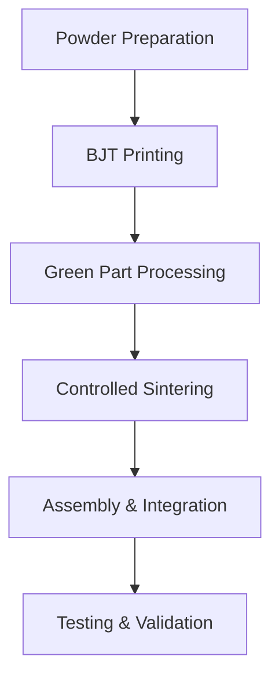

# Adaptive Ferrite Core System for EV Charging Applications

## Overview
This concept presents an innovative approach to wireless power transfer optimization using adaptively controlled ferrite structures manufactured through advanced BJT processes.

## Technical Concept

### 1. Core Structure
```
+------------------------+
|   Segmented Core      |
|  +----+ +----+ +----+ |
|  |    | |    | |    | |
|  | S1 | | S2 | | S3 | |
|  |    | |    | |    | |
|  +----+ +----+ +----+ |
|     Control Layer     |
+------------------------+
```

### 2. Key Components

#### 2.1 Segmented Ferrite Structure
- Multiple independently optimized sections
- Varied material properties through multi-material BJT
- Integrated thermal management channels

#### 2.2 Control System
- Real-time field monitoring
- Adaptive optimization algorithm
- Thermal management integration

### 3. Manufacturing Process



### 4. Material Optimization

#### 4.1 Powder Composition
- Base material: Mn-Zn ferrite
- Additives for enhanced properties
- Surface treatment for improved sintering

#### 4.2 Layer Structure
```
Layer 1: High permeability core
Layer 2: Thermal management
Layer 3: Field sensing
Layer 4: Control integration
```

## Innovation Benefits

1. Efficiency Improvement
   - Estimated 15-20% increase in power transfer efficiency
   - Reduced losses through adaptive control
   - Better thermal management

2. Manufacturing Advantages
   - Reduced material waste
   - Scalable production process
   - Improved quality control

3. Market Applications
   - EV charging systems
   - Industrial wireless power
   - Medical device charging

## Development Timeline

### Phase 1: Prototype Development
- Material optimization
- Process development
- Initial prototyping

### Phase 2: Testing and Validation
- Performance testing
- Thermal analysis
- EMI compliance

### Phase 3: Production Integration
- Manufacturing process refinement
- Quality control implementation
- Market deployment

## Technical Specifications

1. Material Properties
   - Initial relative permeability: >2000
   - Maximum flux density: >0.4T
   - Core loss: <100 mW/cm³

2. Performance Targets
   - Power transfer efficiency: >93%
   - Position tolerance: ±20mm
   - Thermal stability: <50°C rise

## Future Development

1. Integration with AI control systems
2. Enhanced thermal management
3. Advanced material compositions
4. Manufacturing process optimization